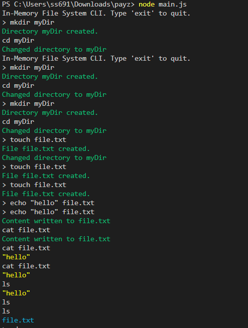

In-Memory File System CLI
=========================



This project implements an in-memory file system using Node.js, which simulates basic file system operations like creating directories, reading and writing files, and listing directory contents. The project is a CLI-based application designed to emulate commands such as `mkdir`, `cd`, `ls`, `touch`, `cat`, `echo`, `mv`, `cp`, and `rm` in an interactive command-line environment.

Table of Contents
-----------------

-   [Design Overview](#design-overview)
-   [Data Structures](#data-structures)
-   [Key Design Decisions](#key-design-decisions)
-   [Setup and Installation](#setup-and-installation)
    -   [Docker Setup](#docker-setup)
    -   [Manual Setup](#manual-setup)
-   [Commands](#commands)
-   [Usage Examples](#usage-examples)

Design Overview
---------------

The in-memory file system is built with three main classes:

1.  **File**: Represents a file with a name and content.
2.  **Directory**: Represents a directory that can hold other files or directories.
3.  **FileSystem**: Manages the overall structure, allowing navigation and manipulation of files and directories.

Each file system command is processed by methods within the `FileSystem` class, which operates in the context of a root directory and a current working directory.

Data Structures
---------------

### File

A `File` class instance holds:

-   `name`: The file's name.
-   `content`: The text content of the file.

### Directory

A `Directory` class instance holds:

-   `name`: The directory name.
-   `contents`: An object where keys are the names of files or subdirectories, and values are instances of either `File` or `Directory`.

### FileSystem

A `FileSystem` instance contains:

-   `root`: The root directory (`/`) of the file system.
-   `currentDir`: Tracks the current working directory and allows navigation within directories.

### Parent References in Directories

A `parent` property in `Directory` instances allows for moving up in the directory tree, supporting navigation commands like `cd ..`.

Key Design Decisions
--------------------

1.  **In-Memory Structure**: Using JavaScript objects allows for rapid access and manipulation, making it easy to prototype the file system.
2.  **Single Root Directory**: The root (`/`) is fixed and serves as the starting point of the directory tree.
3.  **Error Handling and Logging**: The `chalk` library provides colored output for success, warning, and error messages to make CLI interaction more user-friendly.
4.  **Object Composition for Contents**: Each directory's contents are stored as an object (`contents`), where keys are names of files or directories. This provides constant-time access by name.

Setup and Installation
----------------------


### Manual Setup

If you want to set up the project without Docker:

1.  **Clone the Repository**:

    ```bash

    `git clone https://github.com/shubham691438/inMemory-file-system.git
    cd in-memory-file-system`

2.  **Install Dependencies**:

    ```bash

    `npm install`

3.  **Run the Application**:

    ```bash

    

    `node main.js`

Commands
--------

The following commands are supported by the in-memory file system CLI:

-   **mkdir `<name>`**: Create a new directory with the specified name.
-   **cd `<path>`**: Change to the specified directory. Use `/` for the root, `..` for the parent directory.
-   **ls**: List contents of the current directory.
-   **touch `<name>`**: Create a new file with the specified name.
-   **cat `<name>`**: Display the contents of the specified file.
-   **echo `<content>` `<name>`**: Write content to a specified file. Creates the file if it doesn't exist.
-   **mv `<source>` `<destination>`**: Move a file or directory to a new location.
-   **cp `<source>` `<destination>`**: Copy a file or directory to a new location.
-   **rm `<name>`**: Remove a file or directory.
-   **exit**: Quit the CLI.

Usage Examples
--------------

```plaintext


`mkdir myFolder         # Creates a directory named myFolder
cd myFolder            # Changes to myFolder directory
touch file1.txt        # Creates an empty file named file1.txt
echo "Hello, World!" file1.txt  # Writes content to file1.txt
cat file1.txt          # Displays the content of file1.txt
ls                     # Lists contents of the current directory
cd ..                  # Moves back to the parent directory
rm file1.txt           # Removes file1.txt
exit                   # Exits the CLI`
